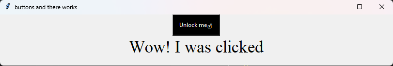
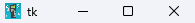
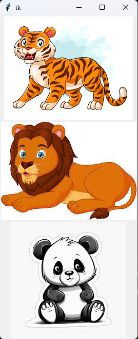

<!--

   <h1>Python Tkinter Runthrough</h1>
   <ul align = "center" >
     <li align = "center">
        

            <h2>For Buttons</h2>
        

        
     </li>
     <li align = "center">
        

            <h2>For Entry</h2>
        

        
     </li>
     <li align = "center">
        

            <h2>For Icon</h2>
        

        
     </li>
     <li align = "center">
        

            <h2>For Image</h2>
        

        
     </li>

   </ul>
   

-->
