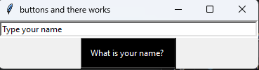

<!--# Interesting-Python

Trying to do some things with Tkinter and random library of Python

**Buttons Interface**

**Entry/input**

-->

   <h1>Python Tkinter Runthrough</h1>
   <ul>
     <li>
For Buttons
</li>
     <li>
For Entry
</li>
     <li>
For Icon
</li>
   </ul>
   

